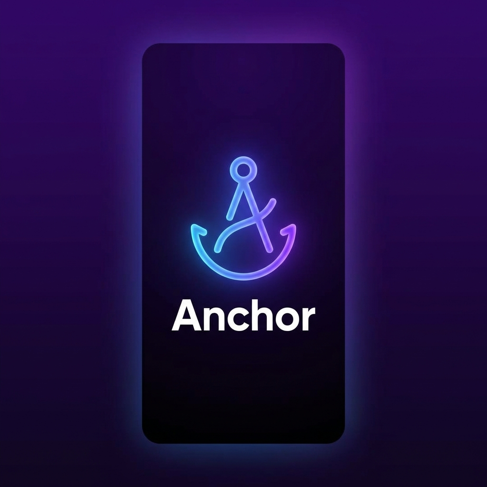
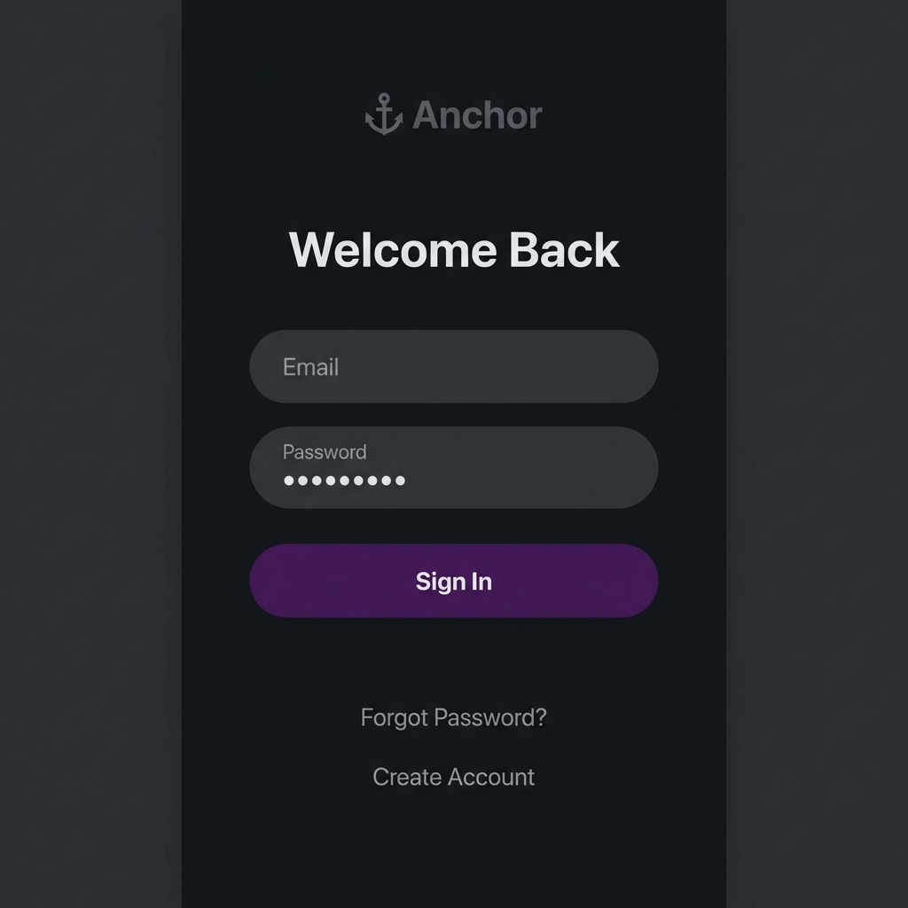
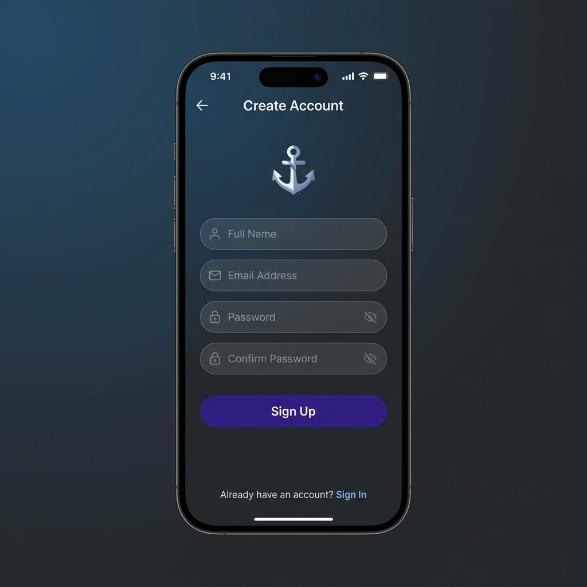
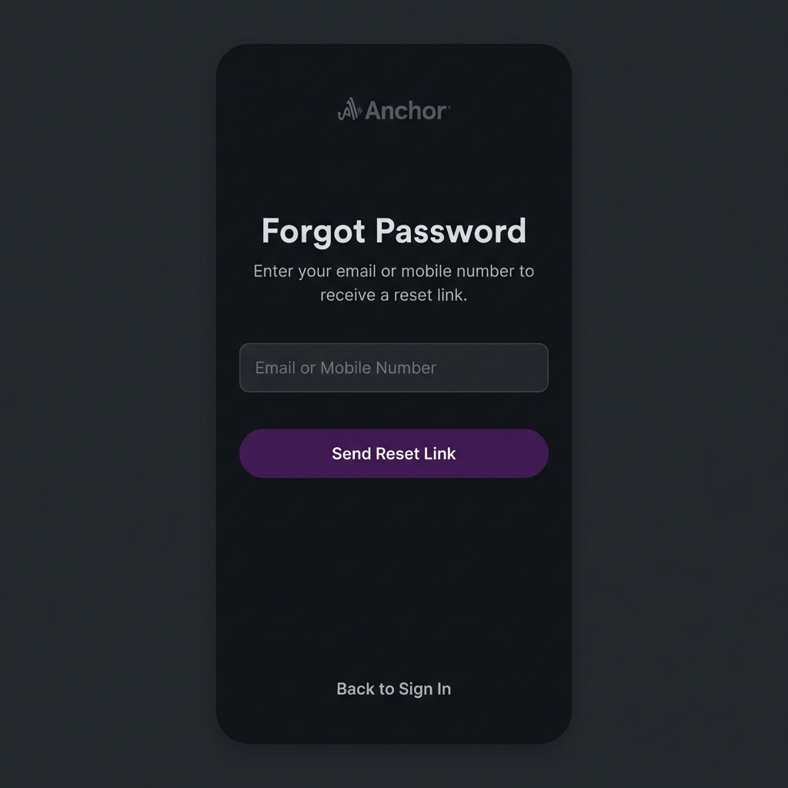

# Design Specification: Anchor (Mobile & Web)

## Overview
This document outlines the design for "Anchor", a messaging application inspired by Microsoft Teams, but enhanced with modern social features.

## Core Layout (Desktop/Tablets)
The application follows a revamped navigation structure:

1.  **Main Interaction Rail (Left Sidebar)**:
    *   **Activity**: Central hub for updates. Displays sent/received friend requests, suggested video channels, and suggested friends details.
    *   **Chat**: 1:1 and Group messaging threads.
    *   **Channels**: Dedicated UI for Video Channels.
    *   **Reels**: Short-form video feed.
2.  **Middle/Main Area**: Context-dependent content based on selection.
3.  **Profile Access**:
    *   **Location**: Top-Left corner (User Logo/Avatar).
    *   **Behavior**: Clicking the avatar opens a **Left-Side Deck** (Drawer) containing Profile details, Settings, and Status.

## Mobile Layout
*   **Navigation**: Bottom Tab Bar with 4 specific items: **Activity**, **Chat**, **Channels**, **Reels**.
*   **Profile**: Accessed via User Avatar in the top-left of the header. Opens as a side drawer.

## Detailed Features

### 1. Teams & Channels Structure
Similar to MS Teams, users participate in "Teams". Each Team can have multiple "Channels".
**Innovation**: Channels are not just text-based. They have TYPES.

*   **# Text Channel (Standard)**: Threaded messaging, file sharing, rich text.
*   **🔊 Audio Channel (Voice Room)**:
    *   **Concept**: An always-on voice room similar to Discord Voice Channels.
    *   **UI**: Users in the channel appear as avatars in a grid or list in the Main Content Area. Active speakers are highlighted.
    *   **Controls**: Mute, Deafen, Share Screen button (promotes to video/stream).
*   **📹 Video Channel (Meeting Room)**:
    *   **Concept**: A dedicated space for drop-in video conferencing.
    *   **UI**: Large video grid. "Join" button required to enter to prevent accidental camera enabling. Background effects options on entry.
*   **📱 Reels Channel (Async Video Updates)**:
    *   **Concept**: A TikTok/Instagram Reels style feed for asynchronous team updates, culture sharing, or massive announcements.
    *   **UI**: Single vertical video player taking up the Main Content Area.
        *   **Sidebar**: Comments, Likes, "Next/Prev" arrows (on desktop) or scroll (touch).
        *   **Creation**: "Record Reel" button to capture webcam/screen snippets (max 60s).

### 2. Main Dashboard Wireframe Description
*   **Header**: Search bar (center), User Profile (right).
*   **Left Rail**: Icons for "Teams", "Chat", "Activity". Selected: "Teams".
*   **Team Pane (Second Column)**:
    *   **Team Header**: "Engineering Team"
    *   **Channel List**:
        *   `# general` (Text icon)
        *   `# announcements` (Text icon)
        *   `🔊 water-cooler` (Speaker icon) - *Shows small avatars of 3 people inside.*
        *   `📹 daily-standup` (Video icon)
        *   `📱 team-culture` (Reels/Play icon)
*   **Main Area (Right Column)**:
    *   Shows the content of the selected channel.

### 3. Authentication Flow
*   **Sign Up**: Clean, step-by-step process.
    *   Step 1: Email/SSO (Google/Microsoft).
    *   Step 2: Team Creation or Join Code.
    *   Step 3: Profile Setup (Avatar, Name, Job Title).
*   **Sign In**: Simple email/password or Magic Link login.
*   **Style**: Minimalist, centered card on Desktop; Full screen on Mobile. Background features subtle abstract "Anchor" patterns.

### 4. User Profile & Settings
*   **Profile**: Large header image, avatar, status (Online/Busy/Do Not Disturb), "About Me", and "Org Chart" view.
*   **Settings**:
    *   **Appearance**: Dark/Light mode toggle, Accent color picker.
    *   **Notifications**: Granular control per channel/team.
    *   **Privacy**: Presence visibility.

## Visual Wireframes (Interactive)

To view the **exact design** we will implement, please open the following HTML files in your browser. These serve as high-fidelity interactive wireframes.

### 1. Desktop Dashboard
*   **File**: [wireframe_desktop.html](file:///C:/Users/Pawan%20Suryawanshi/.gemini/antigravity/brain/f3313a1c-d3d9-4a28-9b53-0250967a6881/wireframe_desktop.html)
*   **Features**: Click the **User Avatar** (Top-Left) to test the **Side Deck Profile**.

### 2. Mobile Layout
*   **File**: [wireframe_mobile.html](file:///C:/Users/Pawan%20Suryawanshi/.gemini/antigravity/brain/f3313a1c-d3d9-4a28-9b53-0250967a6881/wireframe_mobile.html)
*   **Features**: Demonstrates the **4-Tab Navigation** and Reels interface. Click the **top-left avatar** to see the mobile drawer.
```text
+----------------+---------------------+---------------------------------------------------------+
| [Avatar]       | [Chat List]         | [Heather: Sync with Mobile Team]                 [Q Search] |
| (Click to open |                     +---------------------------------------------------------+
|  Deck)         | Mark Zuckerberg     | [User Avatar]                                           |
|                | "Hey, layout looks.."|                                                         |
| [ Activity ]   |                     |  [ Bob ]: The new nav is much cleaner.                  |
|                | Sarah Jenkins       |                                                         |
| [ Chat ]       | "Meeting at 3?"     |  [ You ]: Agreed. I like the side deck profile.         |
|                |                     |                                                         |
| [ Channels ]   | Engineering Group   |                                                         |
|                | "Deploying now..."  |                                                         |
| [ Reels ]      |                     |                                                         |
|                |                     |                                                         |
| (Sidebar)      | (List Pane)         | (Main Content Area)                                     |
+----------------+---------------------+---------------------------------------------------------+
```

### 2. Left-Side Profile Deck (Opened)
```text
+---------------------------+-----------------------------------------------+
|  PROFILE DECK             | [ Dimmed Main Content... ]                    |
|                           |                                               |
|  [ Large Avatar ]         |                                               |
|                           |                                               |
|  Sarah Jenkins            |                                               |
|  Senior Engineer          |                                               |
|  (O) Online               |                                               |
|                           |                                               |
|  -----------------------  |                                               |
|  Acccount Settings        |                                               |
|  Notifications            |                                               |
|  Appearance (Dark)        |                                               |
|  Privacy                  |                                               |
|                           |                                               |
|  [Sign Out]               |                                               |
+---------------------------+-----------------------------------------------+
```

## Visual Wireframes (High Fidelity)

Generated based on the updated 4-Tab Navigation & Side Profile design.

### Desktop Dashboard (4-Tab Layout)


### Mobile Home (4-Tab Layout)


### Auth Screens
#### Splash Screen


#### Sign In Screen


#### Sign Up Screen


#### Forgot Password Screen

